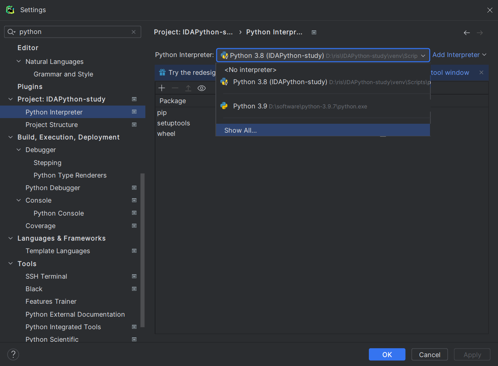
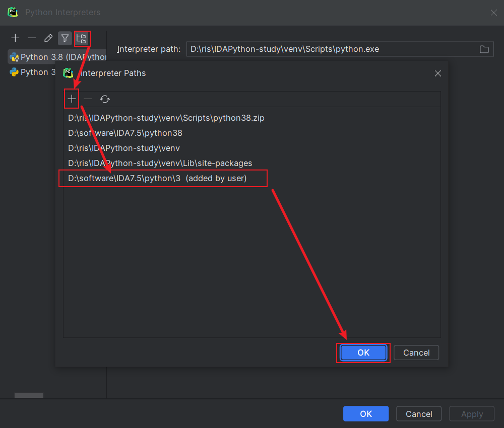

# IDAPython-study
存放一些学习IDAPython的脚本，以及一些学习笔记。

## 配置编写环境
这里我使用的是pycharm作为编写IDAPython脚本的环境。
1. 新建venv环境，这里使用的是IDA7.5自带的python3.8来作为虚拟环境的python解释器。
2. 在解释器中添加路径，方便pycharm识别IDA的库文件。
选择show all，然后点击加号，添加IDA的库文件路径，如下图所示。

3. 最后就可以直接在pycharm中编写IDAPython脚本了。
